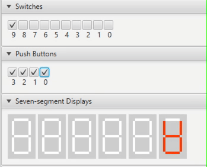

# Processor
Verilog 16-bit, 8-register, interrupt-enabled processor with a wide range of memory mapped I/O such as a VGA display and private timers. The processor can be synthethized on the DE1_SOC board or using the DESIM simulator.

## Disclaimer about Code / Academic Integrity
Due to Academic Integrity concerns I have been requested to not share the actual source-code for the project. Although most of the content in this processor was above and beyond the course expectations (which were just to implement some of the basic instructions here) I cannot share the actual code for the processor to prevent students from committing academic integrity violations by copying it

This repository contains programs I wrote along with videos of those programs running but it does not contain the actual Verilog for the processor itself. Employers are encouraged to ask me for the Code if you are considering hiring me. I just cannot post it publically to prevent other students from taking it. 

# Instructions
Our processor has a number of instructions, some specified by the course and then a number of them were added as extra instructions later. 
Instruction | Assembly | Meaning | Encoding | Summary 
--- | --- | --- | --- | --- 
mv | mv rX, rY | rX <- rY | 000 0 XXX 000000 YYY | Moves the contents of rY into rX 
mv | mv rX, #D | rX <- #D | 000 1 XXX DDDDDDDDD | Move 9 bits of immediate data into rX
mvt | mvt rX, #D | rX <- (#D << 8) | 001 1 XXX 0 DDDDDDDD | Move 8 bits of immediate data into the upper half of rX
add | add rX, rY | rX <- rX + rY | 010 0 XXX 000000 YYY  | Use the ALU to add rX to rY
add | add rX, #D | rX <- rX + #D | 010 1 XXX DDDDDDDDD  | Use the ALU to add rX to immediate data #D
sub | sub rX, rY | rX <- rX - rY | 011 0 XXX 000000 YYY  | Use the ALU to subtract rX and rY
sub | sub rX, #D | rX <- rX - #D | 011 1 XXX DDDDDDDDD  | Use the ALU to subtract rX and immediate data #D
ld | ld rX, [rY] | rX <- [rY] | 100 0 XXX 000000 YYY | Reads from address rY and puts into rX
pop | pop rX | sp <- rX <- [sp], sp++ | 100 1 XXX 000000 101 | Reads from address rY and puts into rX
st | st rX, [rY] | [rY] <- rX | 101 0 XXX 000000 YYY | Stores rX into address rY
push | push rX | sp--, [sp] <- rX | 101 1 XXX 000000 101 | Reads from address rY and puts into rX
and | and rX, rY | rX <- rX & rY | 110 0 XXX 000000 YYY | Bitwise & rX and rY
and | and rX, #D | rX <- rX & #D | 110 1 XXX DDDDDDDDD  | Use the ALU to add rX to immediate data #D
cmp | cmp rX, rY | Flags Updated | 111 0 XXX 000000 YYY  | Compare rX to rY
cmp | cmp rX, #D | Flags Updated | 111 1 XXX DDDDDDDDD  | Compare rX to #D
lsl | lsl rX, rY | rX <- rX << rY | 111 0 XXX 10 00 00 YYY  | Logical left shift
lsr | lsr rX, rY | rX <- rX >> rY | 111 0 XXX 10 01 00 YYY  | Logical right shift
asr | asr rX, rY | rX <- rX >>> rY | 111 0 XXX 10 10 00 YYY  | Arithmetic right shift
ror | ror rX, rY | rX <- rX <<>> rY | 111 0 XXX 10 11 00 YYY  | Rotate Right
lsl | lsl rX, #D | rX <- rX << #D| 111 0 XXX 11 00 0 DDDD  | Logical left shift
lsr | lsr rX, #D | rX <- rX >>#D | 111 0 XXX 11 01 0 DDDD  | Logical right shift
asr | asr rX, #D | rX <- rX >>> #D | 111 0 XXX 11 10 0 DDDD  | Arithmetic right shift
ror | ror rX, #D | rX <- rX <<>> #D | 111 0 XXX 11 11 0 DDDD  | Rotate Right
or | or rX, rY | rX <- rX or rY | 111 0 XXX 01 00 00 YYY  | or between two registers
or | or rX, #D | rX <- rX or #D | 111 0 XXX 01 00 0 DDDD  | or with immediate data, #D must be (any) power of 2
xor | xor rX, rY | rX <- rX ^ rY | 111 0 XXX 01 01 00 YYY  | xor between two registers
xor | xor rX, #D | rX <- rX ^ #D | 111 0 XXX 01 01 0 DDDD  | xor with immediate data, #D must be (any) power of 2
bic | bic rX, rY | rX <- rX & ~rY | 111 0 XXX 01 10 00 YYY  | bic between two registers (rX <- rX & ~rY)
bic | bic rX, #D | rX <- rX & ~#D | 111 0 XXX 01 10 0 DDDD  | bic with immediate data, #D must be (any) power of 2
mvn | mvn rX, rY | rX <- ~rY | 111 0 XXX 01 11 00 YYY  | move logical negation of rY into rX
mvn | mvn rX, #D | rX <- ~#D | 111 0 XXX 01 11 0 DDDD  | logical negation with immediate data, #D must be (any) power of 2 (#D will be inverted)

## Additional logical instructions
Using a gap in the original instruction encoding, we added four new logical instructions to the processor. These are the OR, XOR, BIC, and MVN instructions.
These instructions are encoded similarly to the shifting instructions, except that the 8th bit is a 0 instead of a 1.

Like the shifting instructions, the logical instructions contain only four bits of immediate data. These four bits one-hot decoded to represent any power of two. This allows the instructions to be used to set, unset, or toggle a flag bit in any part of a 16-bit register in a single instruction. In the assembly file, this immediate data must be written out in post-decoding form, I.E. as #1, #2, #4, #8, etc, and the assembler will encode the immediate data automatically.

Note that for the MVN instruction, the immediate data will be logically negated before being moved into rX. E.G. the instruction MVN r0, #0x0008 would actually store the value 0xFFF7 into r0.

To use the logical instructions in a program, a modified version of the sbasm.py assembler is required, which can be found in this repository. 

Here is a demo, which uses the additional logical instructions to implement our ARM lab 4 on our own enhanced processor. Whatever values are input on the switches, the hex displays are updated with the longest sequences of zeros, ones, and alternating zeros/ones in the switches:

# Hardware Units
## Main Memory (0x0XXX)
We expanded our main memory from the provided 256 words to 4096 words of memory. The memory ranges from address `0x0000` to `0x0FFF`.  

## Normal I/O Devices


### LED Output (0x1000)
There are 8 LED' that are available for access by the processor which are memory mapped to address `0x1000`. When you write a word to this address the 8 LSB's of the word are displayed on the LEDs. 

### 7-Segment Displays (0x2000 - 0x2004)
There are 5 7-segment displays assigned the addresses from `0x2000` to `0x2004`. When you write to a HEX display it will take the 7 LSB's of the word which each corospond to one of the segments in the display. 

### Switches (0x3000)
There are 8 switches. When you read from address `0x3000` it will return a single word where the 8 LSB of the word corospond to the values on the 8 switches. 

## VGA Display (0x4000)
We built two hardware units that interact with the VGA display both of which are prefixed with the 0x4XXX address range. The first unit is for drawing characters to the screen and is used for string input and intput and the second is used to draw rectangles to create graphics. 

The paradmime for using the VGA display is that you write a draw command to it by storing a word of memory at the appropriate addresses and then it begins drawing the shape. Once it is done drawing it will write an output `DONE=1` that can be read at the address `0x4000` (technically any address starting in 0x4). Before writing anything to the VGA hardware adapters it is important that you poll to ensure that it is done whatever it is currently writing. After that you can issue new drawing tasks to it. 

#### Polling Example
This subroutine will poll until 
```
.define VGA_ADDRESS 0x4000

POLL:
    push r0 //Save r0
    push r1 //Save r1
    mvt r1, #VGA_ADDRESS
POLL_LOOP:
    ld r0, [r1] //Read to check if it is done drawing
    cmp r0, #0 //Compare to see if it is zero
    beq POLL_LOOP //While DONE=0 it is still drawing, once it is done then DONE=1 gets set and we move on 
    
    pop r1
    pop r0
    mv pc, lr //return from subroutine
```

### Rectangle Hardware Unit (0x400X)
If you want to draw a rectangle to the screen all you need to do is draw is write the two corners to the appropriate addresses and then write the colour which tells the hardware to draw the shape. 

This hardware unit contains 2 registers as follows:
Address | 0x4000 | 0x4001 | 0x4002
--- | --- | --- | --- 
Functionality | Lower (x,y) corner. | Upper (x,y) corner| Colour / Draw 
Encoding | 0YYYYYYYXXXXXXXX | 0YYYYYYYXXXXXXXX | 0000000000000RGB

A position (x,y) is encoded as follows `16 bits = 0YYYYYYYXXXXXXXX`. Then you write an RGB colour and once it receieves a colour it will draw the rectangle. 


### Character Hardware Unit (0x4100)
To draw a character to the screen (defined as a 4x4 box) you need to specify the address of the upper left corner and then give it a word that spefies which pixels in the box should be on or off and then you right a colour too it to specify that it should begin writing. 

This hardware unit contains 2 registers as follows:
Address | 0x4100 | 0x4101 | 0x4102
--- | --- | --- | --- 
Functionality | Corner | Values | Colour / Draw
Encoding | 0YYYYYYYXXXXXXXX | VVVVVVVVVVVVVVVV | 0000000000000RGB

The positions are encoded just like before. For the values each bit corosponds to if a specific pixel in the box should be on. 
Col 1 | Col 2 | Col 3 | Col 4
--- | --- | --- | --- 
15 | 14 | 13 | 12
11 | 10 | 9 | 8
7 | 6 | 5 | 4
3 | 2 | 1 | 0

Here are the encodings for all the characters needed to write text to the screen using this method. 
  

## Strings Example Program
A simple hello world program.  
     
 
```
.define LED_ADDRESS 0x1000
.define HEX_ADDRESS 0x2000
.define SW_ADDRESS  0x3000
.define CHAR_VGA_ADDRESS 0x4100

.define END_STRING 0xFF

START:
    mvt sp, #0x0800
    b MAIN

MAIN:
    mv r0, #ALL_CHARS
    mvt r1, #0x2F00
    add r1, #0xF
    mv r2, #0b010
    bl WRITE_STRING


    mv r0, #HELLO_WORLD
    mvt r1, #0x3F00
    add r1, #0xF
    mv r2, #0b100
    bl WRITE_STRING
END_MAIN: b END_MAIN


ALL_CHARS:
    .word 0x0 //A
    .word 0x1 //B
    .word 0x2 //C
    .word 0x3 //D
    .word 0x4 //E
    .word 0x5 //F
    .word 0x6 //G
    .word 0x7 //H
    .word 0x8 //I
    .word 0x9 //J
    .word 0xa //K
    .word 0xb //L
    .word 0xc //M
    .word 0xd //N
    .word 0xe //O
    .word 0xf //P
    .word 16 //Q
    .word 17 //R
    .word 18 //S
    .word 19 //T
    .word 20 //U
    .word 21 //V
    .word 22//W
    .word 23//X
    .word 24//Y
    .word 25//Z
    .word 26//space
    .word 27//!
    .word 28//.
    .word 0xFF //END OF STRING

HELLO_WORLD:
    .word 0x7 //H
    .word 0x4 //E
    .word 0xb //L
    .word 0xb //L
    .word 0xe //O
    .word 28//.
    .word 26//space
    .word 22//W
    .word 0xe //O
    .word 17 //R
    .word 0xb //L
    .word 0x3 //D
    .word 27//!
    .word 0xFF //END OF STRING


//LIBRARY STARTS HERE

//r0 = pointer to start of string
//r1 = position [y,x] to write the first char
//r2 = colour to draw in
WRITE_STRING:
    push r0
    push r3
    push r4
    push r6

    mv r4, r0 //r4 points to address in the string
    mv r3, #END_STRING
STRING_LOOP:
    ld r0, [r4] //Get the character as an offset

    cmp r0, r3 //#0xFF compare to END
    beq END_STRING_LOOP

    bl WRITE_CHAR //draw the character

    add r4, #1 //Increment to next char in the string
    add r1, #5 //Shift 5 pixels to the right for next char
    b STRING_LOOP
END_STRING_LOOP:
    pop r6
    pop r4
    pop r3
    pop r0
    mv pc, lr

//Takes char (as an offset) in r0, displays it to the VGA
//Takes a position in r1 [y,x]
//Colour in r2
WRITE_CHAR:
    push r0
    push r4
    push r6 //lr

    bl POLL //poll
    mvt r4, #CHAR_VGA_ADDRESS
    st r1, [r4] //Put position as 16,16

    add r4, #1 //Move to the data position    
    bl CHAR_CODE
    st r0, [r4] //write the data, should be alternating bits

    add r4, #1 //increment
    st r2, [r4]

    pop r6 //lr
    pop r4
    pop r0
    mv pc, lr


//Input = r0, output = code for writing r0 in r0
CHAR_CODE:
    push r4
    mv r4, #CHARS
    add r4, r0
    ld r0, [r4]
    pop r4
    mv pc, lr

//Wait for char to finish drawing
POLL:
    push r0
    push r1
    mvt r1, #CHAR_VGA_ADDRESS
POLL_LOOP:
    ld r0, [r1] //Read to check if it is done drawing
    cmp r0, #0
    beq POLL_LOOP //While DONE=0 it is still drawing, once it is done then DONE=1 gets set and we move on 
    
    pop r1
    pop r0
    mv pc, lr

CHARS:
    .word 0b0101011101010010 //'A'
    .word 0b0111010101110001 //'b'
    .word 0b0110000100010110 //'C'
    .word 0b0011010101010011 //'D'
    .word 0b0110000101110110
    .word 0b0001011100010111
    .word 0b0111011100010111
    .word 0b0101011101010000
    .word 0b0111001000100111
    .word 0b0010010101000100
    .word 0b0101001101010001
    .word 0b0111000100010001 //L
    .word 0b1001100111111001
    .word 0b1001101111011001
    .word 0b0110100110010110
    .word 0b0001001101010111
    .word 0b1010010101010010
    .word 0b0101001101010011
    .word 0b0111011000010110
    .word 0b0110011001101111
    .word 0b0110100110011001
    .word 0b0010010101010101
    .word 0b1001111110011001
    .word 0b1001011001101001
    .word 0b0100010001110101
    .word 0b1111001001001111
    .word 0                  //space
    .word 0b0001000000010001
    .word 0b0011001100000000
 ```

## Private Timer (0x5000)
This is a simple device. You write a reset value and some settings and then it will count down from that number until zero and then when it hits zero it will flag an output that can be polled by the processor, it will trigger an interrupt, and it will optionally reset itself automatically once it hits zero. 

Address | 0x5000 | 0x5001 | 0x5002
--- | --- | --- | --- 
Functionality | Status | Reset Value | Clear Done
Encoding | [13'b0, Auto_reload, Run] | VVVVVVVVVVVVVVVV | Write anything to clear

You can also get input from it by reading from `0x5000` to get the current value in the timer and `0x5001` to get the current DONE value. 

### Private Timer Example (Polled I/O)
```
.define TIMER_ADDRESS 0x5000
.define LED_ADDRESS 0x1000

START:
    mvt sp, #0x0800
    b MAIN
MAIN:
    mvt r4, #TIMER_ADDRESS
    add r4, #1 //Now for the initial value
    mvt r0, #0x1300    //1s * 5000 cycles/sec = 0x1388
    add r0, #0x88
    st r0, [r4] //Set the initial value

    mvt r4, #TIMER_ADDRESS
    mv r0, #0b11 //Auto-reload=1, Run=1
    st r0, [r4] //write values

    add r4, #2 //Point r4 to the register we write to in order to clear done
    mvt r3, #LED_ADDRESS
    mv r2, #0
LOOP:
    ld r0, [r4] //Read if it is done yet
    //st r0, [r3]
    cmp r0, #0
    beq LOOP //Branch while it is not done (done==0)
    st r0, [r4] //If it is done, write 1 to it in order to reset the done flag
    
    st r2, [r3] //Put counter on LED
    add r2, #1 //Increment counter

    b LOOP

    
END: b END
```


## Interrupt Handler (IRQ) (0x6000)
Yes, you read correctly. Our toy processor that we wrote for a Lab has a functioning interrupt handler we were not required to add. Why? I was bored. 

To use the interrupt handler you must first configure the interrupt controller. This can be done with the memory mapped IRQ controller at `0x6000`. 

To setup the IRQ controller you write a word to the address `0x6000` where each bit in the word tells the IRQ controller weather interrupts for a specific device is enabled. Currently the 8 LSB corospond to SW[7:0] and bit 8 specifies the Private Timer. 

After an interrupt is generated it must be cleared before any future interrupts can be generated. To clear it write a word containing a 1 for each device we want to clear interrupts for to the address `0x6001`

### Processor Interrupt Mode
Once an interrupt is triggered in the processor it will substitute the command it normally would have run with `push pc` and it will freeze pc from incrementing so that when we load pc back in later it executes the instruction that got swapped out. After this the processor will branch to address `0x1` in the `Vector Initilization Table` which should specify a branch to a user-defined interrupt handling program. While it is in interrupt handling mode no further interrupts can be triggered. It is extreamly important when in interrupt mode you perserve the register values by first pushing any registers you intend to modify. After that you can check with the IRQ handler to figure out what caused the interrupt and handle it accordingly. Once it is done you pop the registers that you modified and then to return from the error handling you run the command `pop pc`. Running this command will disable error mode and you will be broguht back to wherever in the program you were when the interrupt occured. 

### Code for using IRQ
```
VETOR_TABLE:
    b START //Reset exception
    b IRQ //IRQ Handler Exception

.define LED_ADDRESS 0x1000
.define IRQ_ADDRESS 0x6000

START:
    mvt sp, #0x0100 //Setup SP
    mvt r4, #IRQ_ADDRESS
    mv r0, #0xFF //Turn on IRQ from all switches
    st r0, [r4] //Setup the interrupt handler.

    mv r0, #0
    mvt r4, #LED_ADDRESS
LOOP:
    add r0, #1 //Increment
    st r0, [r4] //Store to LED
    b LOOP


IRQ:
    push r0
    push r1

    mvt r1, #IRQ_ADDRESS
    ld r0, [r1] //Get the current exceptions
    add r1, #1 //To clear we write to second register in IRQ
    st r0, [r1] //By writing a 1 to all bits that had an exception we clear the exception from memory. 

    pop r1
    pop r0
    pop r7 //Return from exception   
```
 

### Example SW IRQ Program
This is a simple peogram where it draws garbage on a hex display and then when you press the switch it changes which hex display it is drawing garbage on where it increments by one.     


```
VETOR_TABLE:
    b START //Reset exception
    b IRQ //IRQ Handler Exception

.define LED_ADDRESS 0x1000
.define HEX_ADDRESS 0x2000
.define SW_ADDRESS  0x3000
.define VGA_ADDRESS 0x4000
.define TIMER_ADDRESS 0x5000
.define IRQ_ADDRESS 0x6000

START:
    mvt sp, #0x0100

    mvt r4, #IRQ_ADDRESS
    mv r0, #0xFF //Turn on IRQ from all switches
    st r0, [r4] //Setup the interrupt handler.

    mv r0, #0
    
    mvt r4, #HEX_ADDRESS
LOOP:
    st r0, [r4]
    add r0, #1
    b LOOP


IRQ:
    push r0
    push r1
    mvt r1, #IRQ_ADDRESS
    ld r0, [r1] //Get the current exceptions
    add r1, #1 //To clear we write to second register in IRQ
    st r0, [r1] //By writing a 1 to all bits that had an exception we clear the exception from memory. 
    
    add r4, #1 //Change the hex display we are drawing on

    pop r1
    pop r0
    pop r7 //Return from exception 
```
### Example IRQ Counter using Private Timer Interrupts
This is another demo, using the private timer to generate interrupts to count on both the LED's and the HEX display:


```
VECTOR_TABLE:
b START
b IRQ //We did not implement IRQ handling here

.define LED_ADDRESS 0x1000
.define HEX_ADDRESS 0x2000
.define TIMER_ADDRESS 0x5000
.define IRQ_ADDRESS 0x6000

START:
    mvt sp, #0x0100
    b MAIN
MAIN:
    bl SETUP_TIMER
    bl SETUP_IRQ
    
    
    mv r3, #COUNTER
LOOP:
    ld r0, [r3] //Get current counter value

    mvt r4, #LED_ADDRESS
    st r0, [r4] //Store current counter on the LED's

    bl REG  
    b LOOP
END: b END

COUNTER:.word 0x1

SETUP_TIMER:
    push r0
    push r4

    mvt r4, #TIMER_ADDRESS
    add r4, #1 //Now for the initial value
    mvt r0, #0x1300    //1s * 5000 cycles/sec = 0x1388
    add r0, #0x88
    st r0, [r4] //Set the initial value

    mvt r4, #TIMER_ADDRESS
    mv r0, #0b11 //Auto-reload and run
    st r0, [r4]

    pop r4
    pop r0
    mv pc, lr

SETUP_IRQ:
    push r0
    push r4

    mvt r4, #IRQ_ADDRESS
    mvt r0, #0xFF00 //Turn on IRQ from all switches
    add r0, #0xFF
    st r0, [r4] //Setup the interrupt handler.

    pop r4
    pop r0
    mv pc, lr

//Note only timer can trigger the IRQ in this setup
IRQ:
    push r0
    push r4

    mvt r4, #TIMER_ADDRESS
    add r4, #2 //Point r4 to the register we write to in order to clear done
    st r4, [r4] //Write anything to the clear register in order to clear the IRQ from the timer

    mvt r4, #IRQ_ADDRESS
    ld r0, [r4] //Get the current exceptions
    add r4, #1 //To clear we write to second register in IRQ
    st r0, [r4] //By writing a 1 to all bits that had an exception we clear the exception from memory.

    mv r4, #COUNTER
    ld r0, [r4] //get counter value
    add r0, #1 //increment counter
    st r0, [r4] //store incremented counter

    //mvt r4, #HEX_ADDRESS
    //st r0, [r4]


    pop r4
    pop r0
    pop r7 //Return from exception


// subroutine that displays register r0 (in hex) on HEX3-0 
REG:   push r1
       push r2
       push r3

       mvt  r2, #HEX_ADDRESS  // point to HEX0

       mv   r3, #0            // used to shift digits
DIGIT: mv   r1, r0            // the register to be displayed
       lsr  r1, r3            // isolate digit
       and  r1, #0xF           // "    "  "  "
       add  r1, #SEG7         // point to the codes
       ld   r1, [r1]          // get the digit code
       st   r1, [r2]
       add  r2, #1            // point to next HEX display
       add  r3, #4            // for shifting to the next digit
       cmp  r3, #16           // done all digits?
       bne  DIGIT
       
       pop  r3
       pop  r2
       pop  r1
       mv   pc, lr

SEG7:  .word 0b00111111       // '0'
       .word 0b00000110       // '1'
       .word 0b01011011       // '2'
       .word 0b01001111       // '3'
       .word 0b01100110       // '4'
       .word 0b01101101       // '5'
       .word 0b01111101       // '6'
       .word 0b00000111       // '7'
       .word 0b01111111       // '8'
       .word 0b01100111       // '9'
       .word 0b01110111       // 'A' 1110111
       .word 0b01111100       // 'b' 1111100
       .word 0b00111001       // 'C' 0111001
       .word 0b01011110       // 'd' 1011110
       .word 0b01111001       // 'E' 1111001
       .word 0b01110001       // 'F' 1110001
```
